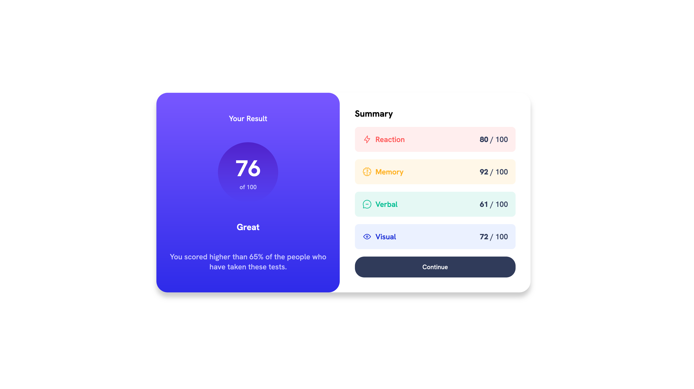

# Frontend Mentor - Results summary component solution

This is a solution to the [Results summary component challenge on Frontend Mentor](https://www.frontendmentor.io/challenges/results-summary-component-CE_K6s0maV). Frontend Mentor challenges help you improve your coding skills by building realistic projects.

## Table of contents

- [Overview](#overview)
  - [The challenge](#the-challenge)
  - [Screenshot](#screenshot)
  - [Links](#links)
- [My process](#my-process)
  - [Built with](#built-with)
  - [What I learned](#what-i-learned)
  - [Continued development](#continued-development)
  - [Useful resources](#useful-resources)
- [Author](#author)
- [Acknowledgments](#acknowledgments)

**Note: Delete this note and update the table of contents based on what sections you keep.**

## Overview

### The challenge

Users should be able to:

- View the optimal layout for the interface depending on their device's screen size
- See hover and focus states for all interactive elements on the page
- **Bonus**: Use the local JSON data to dynamically populate the content

### Screenshot




### Links

- Solution URL: [Add solution URL here](https://your-solution-url.com)
- Live Site URL: [Add live site URL here](https://your-live-site-url.com)

## My process

### Built with

- Semantic HTML5 markup
- CSS custom properties
- Flexbox
- Mobile-first workflow

### What I learned

During this project, I used many flexbox on multiple elements. So there's flexbox within a flexbox. I mainly used it to center the containers.

I had difficulties structuring my HTML at first because the score has a circle so I was deciding whether to use

```html
<h1>76 <span> 86 </span> / 100</h1>
```

with some CSS styling but this way did not help me. I mainly use ems for the width and height but this may not be a good use as the user's font size may be different to 16px. Thus, it may change the entire look of the circle.

Thus, I opted to use the following:

```html
<div class="score">
  <h1>76</h1>
  <p>of 100</p>
</div>
```

I will now use the div to create the circle and use two block elements ( `<h1>` and `<p>`). This makes it easy to style and they are on their own separate line by default.

While I was working on the Desktop view, I had issues on getting the `results-container` and `summary-container` to be equal widths of the parent container. I wanted to use `width: 50%` but it did not seem to work. I was stumped on this but solved it using `flex:1' which will allow each container to grow equally inside the parent container. Now they will be each half of the parent's container.

Now the next issue was that `results-container` did not stretch the whole height of the parent container. The issues was I was using: `height:40%` which forces the height of the `results-container` to be that exact 40% width. This will hold higher precedence even if I attempt to use min or max. So I changed it to `min-width:40%` such that it should be at least 40% of the height for the parent container ( main purpose is for the mobile design) and if necessary, grow (for the desktop design)


### Continued development

Use this section to outline areas that you want to continue focusing on in future projects. These could be concepts you're still not completely comfortable with or techniques you found useful that you want to refine and perfect.

**Note: Delete this note and the content within this section and replace with your own plans for continued development.**

### Useful resources

- [Example resource 1](https://www.example.com) - This helped me for XYZ reason. I really liked this pattern and will use it going forward.
- [Example resource 2](https://www.example.com) - This is an amazing article which helped me finally understand XYZ. I'd recommend it to anyone still learning this concept.

**Note: Delete this note and replace the list above with resources that helped you during the challenge. These could come in handy for anyone viewing your solution or for yourself when you look back on this project in the future.**

## Author

- Website - [Add your name here](https://www.your-site.com)
- Frontend Mentor - [@yourusername](https://www.frontendmentor.io/profile/yourusername)
- Twitter - [@yourusername](https://www.twitter.com/yourusername)

**Note: Delete this note and add/remove/edit lines above based on what links you'd like to share.**

## Acknowledgments

This is where you can give a hat tip to anyone who helped you out on this project. Perhaps you worked in a team or got some inspiration from someone else's solution. This is the perfect place to give them some credit.

**Note: Delete this note and edit this section's content as necessary. If you completed this challenge by yourself, feel free to delete this section entirely.**
